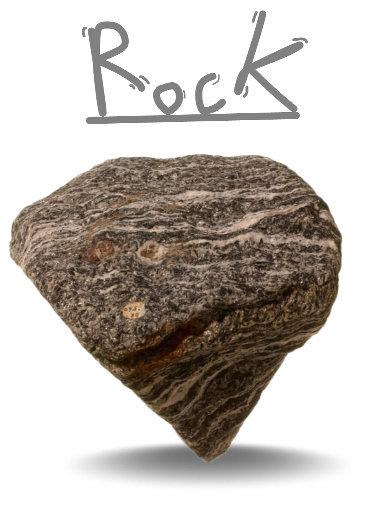
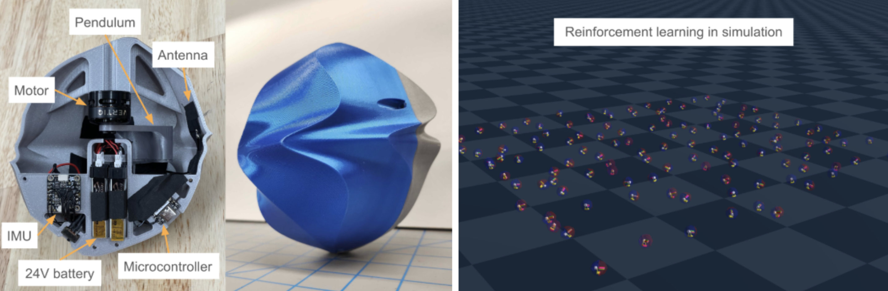
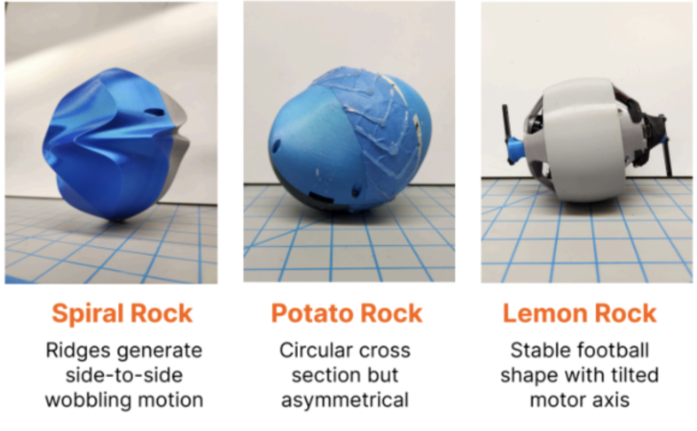
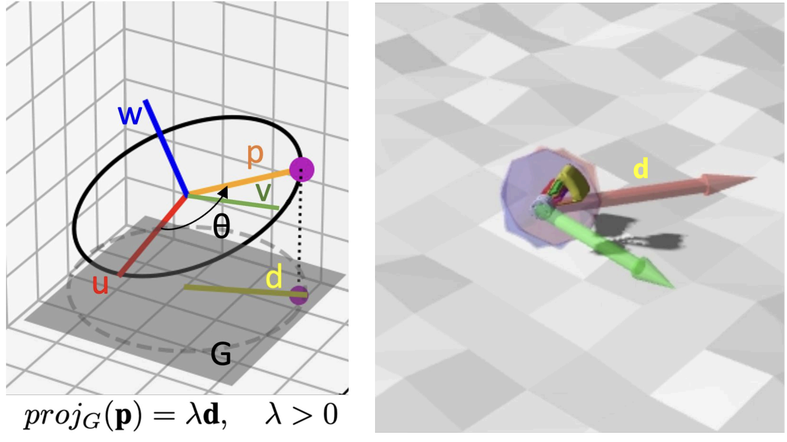
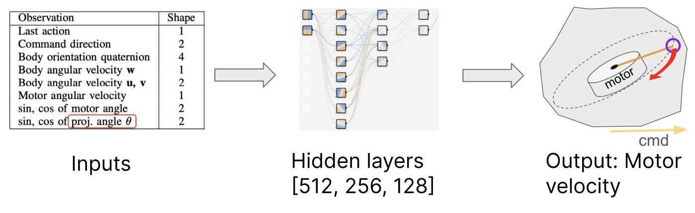
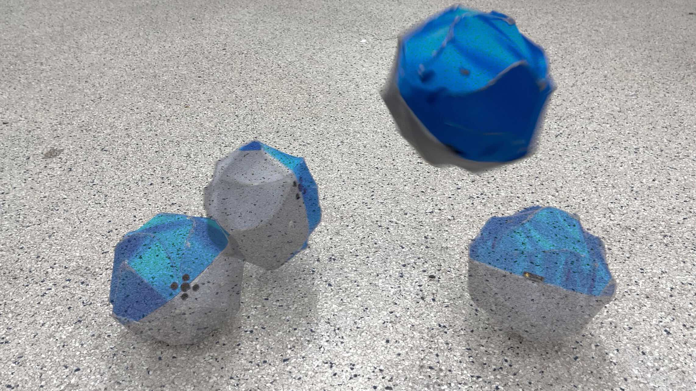

# Rolling One-motor Controlled rocK (ROCK)


<p float="middle">
  
</p>

A fully enclosed shape that tumbles and jumps; controllable movement on a flat surface with only 1 motor and 2 rigid bodies.

<p float="middle">
  
</p>


<p float="middle">
  
</p>


# Hardware
- Microcontroller: Seeeduino Xiao ESP32S3
- Motor: Vertiq 23-06 G1 220KV brushless motor
- IMU: Adafruit BNO085
- Shell: 3D printed
- Pendulum: 3D printed, filled with lead
- Battery: 6x Tattu 220mAh LiPo (22.2V)

An uneven shell creates steering affordances, using the complex ground contacts to couple the dynamics between motion in multiple dimensions. We iterated over 3 designs to improve continuous rolling, consistent turning, and option for interchangable attachments for diverse maneuvers:
<p float="middle">
  
</p>

# Control

<p float="middle">
  
</p>
The robot is teleoperated by commanding a desired rolling direction. We create a simple controller that rolls by offsetting the robot’s center of mass in the direction by manual joystick input.  We also train a reinforcement learning policy to use dynamic pendulum movements for higher performance. The policy is quantized to run on the microcontroller at 90 Hz.

<p float="middle">
  
</p>


# Installation

Create python virtual environment (we use python3.12):
```bash
python3 -m venv .venv
source .venv/bin/activate
```

Install dependencies (genesis-world enforces stricter than necessary version requirements so we install it with --no-deps):
```bash
pip install -r requirements.txt
pip install genesis-world --no-deps
```


# Files directory
```
rock/
├── embedded/
│   ├── convert_torch_to_tflite/     # Convert PyTorch models to TFLite for ESP32
│   ├── esp-tf_speedtest_fw/         # PlatformIO project testing inference speed
│   ├── gimbal_prototype_fw/         # PlatformIO project gimbal prototype
│   └── rock2_fw/                    # PlatformIO project for latest ROCK
│       ├── src/                     # Source code directory
│       │   ├── main.cpp             # Main control loop firmware
│       │   ├── util.h               # Utility functions for IMU and motor control
│       │   ├── all_ops_resolver.h   # TFLite operation definitions
│       │   ├── model_13_26_700.h    # Header for trained model on rough terrain
│       │   ├── model_13_26_700.cpp  # Trained model weights on rough terrain
│       │   ├── model_58_02_200.h    # Header for trained model on smooth terrain
│       │   └── model_58_02_200.cpp  # Trained model weights on smooth terrain
│       ├── trained_models/          # Original TFLite model files
│       └── platformio.ini           # Project configuration and dependencies
├── genesis-sim/
│   ├── balancing/                   # RL environment for balancing, unfinished
│   └── tumbling/                    # RL environment for tumbling, main work
│       ├── rock_env.py              # Defines how the simulation behaves
│       ├── rock_train.py            # Start parallel simulation training
│       ├── rock_eval.py             # Run simulation for policy evaluation 
│       ├── viewer.py                # Run simulation just for viewing
│       ├── analyze_runs.ipynb       # Analyzing run performance with plots
│       ├── runs/                    # Training run output
│       ├── autoruns/                # Automated run output
│       ├── projruns/                # Runs with projection controller
│       └── penaltysweep/            # Runs with sweep of penalty weights
├── onshape/                         # updating cad in python and generating URDF
│   ├── balo/                        # almost symmetric balo shape
│   ├── balo2/                       # test hexagonal shape with stretched vertex
│   ├── intuition2/                  # spiral shell (mostly used this)
│   ├── pmrock/                      # parametric minimal rock
│   ├── rock1/                       # jointed 1 dof rock
│   └── weird_rock/                  # potato shell
├── rockstation/
│   ├── cmdlogs/                     # CSV logs from rockstation
│   ├── decode.ipynb                 # Testing telemetry decoding
│   ├── loganalysis.ipynb            # Notebook for analyzing cmdlogs
|   ├── periodics.py                 # Helper for running functions at fixed rate
│   └── rockstation1-5.py            # Run this to control the robot from laptop
└── sandbox/
    ├── acrobot/                     # Jumping rock is kinda like acrobot
    ├── from_matlab/                 # Prof Yim's MATLAB dynamics, translated
    ├── gpu_accel/                   # Messing around with Taichi and trajopt
    ├── imu_sim/                     # Attempt at velocity estimator from IMU
    ├── littlewood_hoop/             # Unbalanced hoop that jumps
    ├── model_tumbling/              # Projection controller interactive
    ├── quaternions/                 # Visualizing quaternions for IMU calcs
    ├── trajopt/                     # Casadi trajopt
    └── util/                        # Plotting utilities
```


## Most useful files

### `embedded/rock2_fw/src/main.cpp`
Platformio project to control the current prototype that consists of a heavy lead pendulum spinning inside a shell (only 2 rigid bodies). 
- TFLite model inference on ESP32S3 for control
- BNO085 IMU integration for orientation sensing
- Vertiq motor control with configurable parameters
- ESP-NOW wireless communication for remote control
- Support for multiple rock designs (spiral, potato, faceless) with different motor/IMU configurations
- Real-time control loop running at 200Hz with IMU-based feedback

### `embedded/rock2_fw/trained_models/to_tflite.ipynb`
Python notebook to convert a trained pytorch model into a .cpp and .h file that can be copied into an firmware project. Load the model using the ESP-TF Arduino library to perform inference on the ESP32S3. Will quantize the model using int8 in order to use optimized matrix operations using ESP-NN specific to the ESP32S3.

### `embedded/esp-tf_speedtest_fw/`
Platformio project to test inference speed of a fully connected neural network using the ESP-TF Arduino library. The model is trained and converted using the jupyter notebooks in `convert_torch_to_tflite`, which generates the .cpp and .h file. Uses the Seeeduino XIAO ESP32S3 and requires no hardware connections.

### `onshape/intuition2/get_urdf.py`
Each subdirectory in onshape/ corresponds to a different prototype and contains the URDF file, meshes, and script to generate the URDF. get_urdf.py is a script to modify Onshape variables and generate the URDF. Use the URDF Visualizer VS Code extension to visualize the URDF.

### `genesis-sim/tumbling/rock_env.py`
The simulation environment for the ROCK project using the Genesis physics engine. Here the terrain, simulation step, observations, actions, and reward functions are defined. 

### `rockstation/rockstation4.py`
Control station software for interfacing with the physical ROCK prototypes through the e-stop (see https://github.com/novelMobileRobotsLab/pinto-squirrel for estop setup). Includes serial communication, joystick control, and telemetry handling. The `cmdlogs` directory contains logs of commands sent to the rock.


## Operation

Very similar to the [Pinto Squirrel](https://github.com/novelMobileRobotsLab/pinto-squirrel). 


1. **Connect Estop to Laptop**
   - Connect estop device to laptop via USB
   - Determine COM port (Windows) or serial port (Linux/Mac)
   - Update the `port` variable in `rockstation4.py`
   - Verify small yellow light near USB port is blinking on estop

2. **Run Station Software**
   - Execute `python rockstation4.py`
   - Should display: "estop_ok" and "gamepad disconnected"

3. **Connect Gamepad**
   - Connect BINBOK Nintendo Switch controller (or Xbox controller) via Bluetooth or USB
   - Use apps like joystickMonitor to verify laptop can read controller
   - Terminal should display: "please calibrate joysticks"
   - Calibrate joysticks by moving them in a circle around the boundary

4. **Power On Robot**
   - Connect 6S LiPo battery (voltage must be >20V) and flip switch
   - Vertiq motors make a sound

5. **Release Emergency Stop**
   - Twist to unpress the estop button if pressed

6. **Joystick Control**
   - Hold the right bumper (index finger) to enable joystick control
   - Right joystick controls the robot rolling direction (spiral rock or potato rock) or pendulum angle with respect to gravity (lemon/faceless rock)
   - Left joystick controls the raw pendulum voltage (can spin very fast!)
   - Holding right trigger (middle finger) will enable neural net control using right joystick

7. **Telemetry**
   - The terminal will display the robot's telemetry like battery voltage, motor speed, and IMU orientation
   - The telemetry can be logged to `cmdlogs/` if csv writing lines are uncommented in `rockstation4.py`


<p float="middle">
  
</p>


## Other links
- Box: https://uofi.box.com/s/ce05dxp6a3c5nzs4ssj1djv3fu2zbas0 
- Offboarding Doc (summary): https://uofi.box.com/s/l9rvpnbomtzitpidy1dohexe3kvcctp4 
- Miro: https://miro.com/app/board/uXjVLCX5D08=/?share_link_id=853017013042
- Workshop abstract: https://arxiv.org/abs/2504.11748  